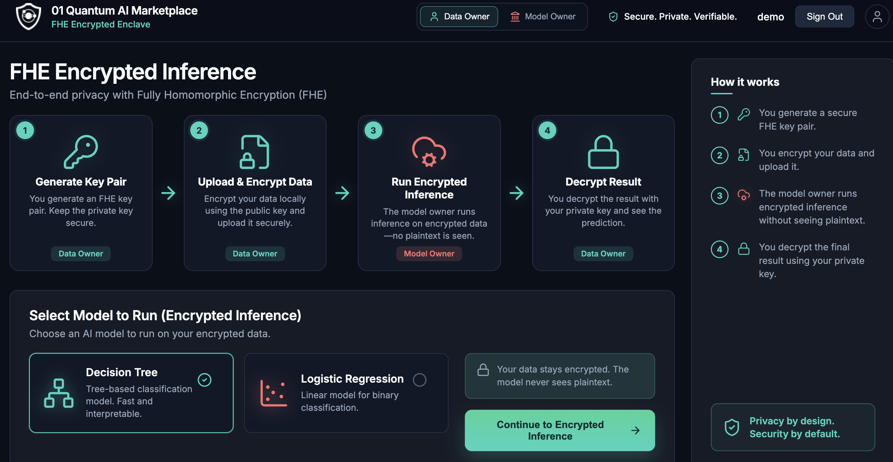
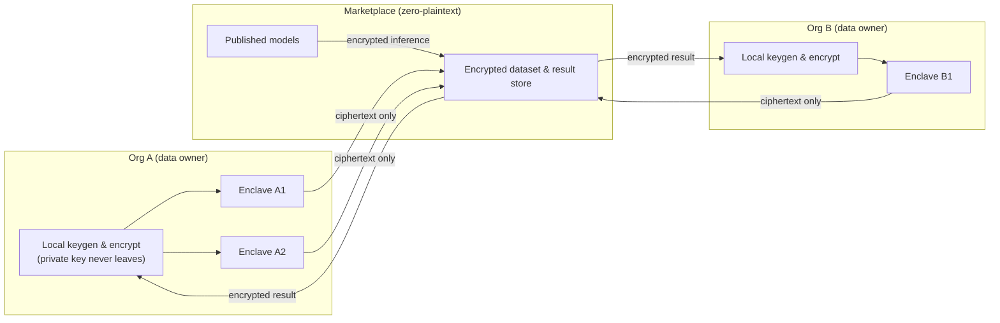

# 01 Quantum AI Marketplace

**Live app:** [https://01-quantum.github.io/ai-marketpace/](https://01-quantum.github.io/ai-marketpace/)

Privacy-preserving inference marketplace built on **Fully Homomorphic Encryption (FHE)**. Models run directly on encrypted data — the model owner never sees plaintext, and only the data owner can decrypt the result.



## The problem

Running a model on someone else's data usually forces a bad trade-off: either the data owner ships raw data to the model (losing privacy), or the model is handed over to the data owner (losing IP and control). For regulated data — health records, financial transactions, or **prompts and context sent to an LLM** — neither option is acceptable.

FHE removes the trade-off. Computation happens on ciphertext, so:

- **Data owners** keep plaintext on their own machine. Encryption and decryption happen locally with a private key that never leaves.
- **Model owners** run inference inside an enclave on data they can never read.
- **Results** are verifiable and decryptable only by the data owner.

This makes the platform a fit for **decision and LLM policy enforcement** — e.g. scoring whether a request is allowed, classifying risk, or gating an action — without exposing the underlying prompt, features, or business rules to either side.

## How it works

A four-step workflow shared between the two roles:

1. **Generate key pair** — data owner creates an FHE key pair; the private key stays local.
2. **Upload & encrypt** — data is encrypted locally with the public key, then uploaded.
3. **Run encrypted inference** — the model owner evaluates the model on ciphertext inside the enclave; no plaintext is ever seen.
4. **Decrypt result** — only the data owner decrypts the prediction, with a full audit trail.

## High-level design

Each organization runs its **own enclaves**. Encryption, key custody, and decryption stay **local to the org** — only ciphertext crosses the boundary.



- **Per-org enclaves** — an org can run multiple enclaves; encrypted ops are isolated per org.
- **Local crypto** — keygen, encryption, and decryption execute on the data owner's side.
- **Zero-plaintext marketplace** — the shared layer only ever holds ciphertext and published model definitions.

## Features

- **Landing overview** — role-based intro to the FHE inference workflow
- **Data Owner workspace** — key generation, local encryption, encrypted dataset upload
- **Model Owner workspace** — review incoming ciphertext, run encrypted inference, return results
- **Decrypt & view result** — local decryption with audit trail
- **Model Builder Studio** — design decision tree / logistic regression models and publish to the enclave

Models can be kept private, published, or **shared with specific users**, enforced by Supabase row-level security. See [`supabase/README.md`](supabase/README.md) and [`supabase/create-tables.sql`](supabase/create-tables.sql).

## Development

```bash
npm install
npm start
```

Open [http://localhost:4200/](http://localhost:4200/) — the app reloads on source changes. Only the landing page is public; all other routes require sign-in.

## Build & deploy

```bash
npm run build            # output in dist/ai-marketpace/
npm run deploy:gh-pages  # publish to GitHub Pages
```

Then set **Settings → Pages → Deploy from branch → `gh-pages` / root**. The site serves at `/ai-marketpace/`; if the repo is renamed, update `baseHref` in `angular.json` under the `gh-pages` configuration.

## Tests

```bash
npm test
```

## Tech stack

- [Angular](https://angular.dev/) 21 (standalone components)
- [Supabase](https://supabase.com/) — auth, Postgres, row-level security
- [Lucide Angular](https://lucide.dev/) icons
- [Vitest](https://vitest.dev/) for unit tests

## Contributing

See [CONTRIBUTING.md](CONTRIBUTING.md) for setup, pull request expectations, and code guidelines.

## License

This project is licensed under the [MIT License](LICENSE).
