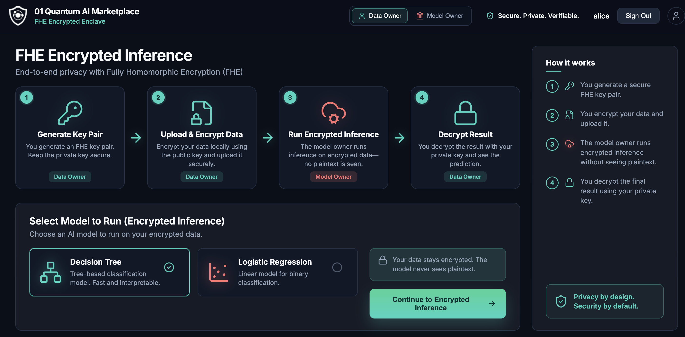
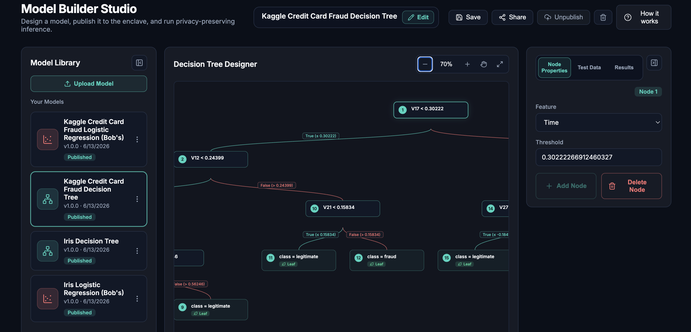
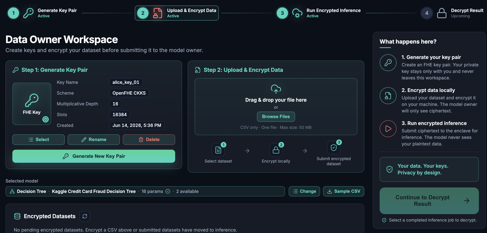
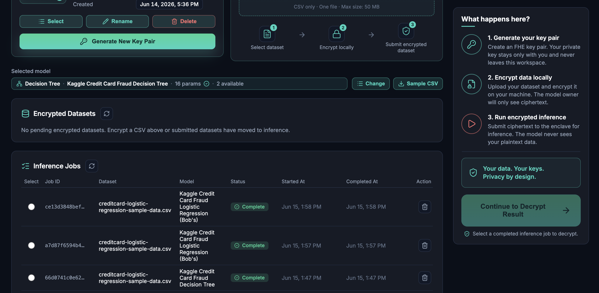
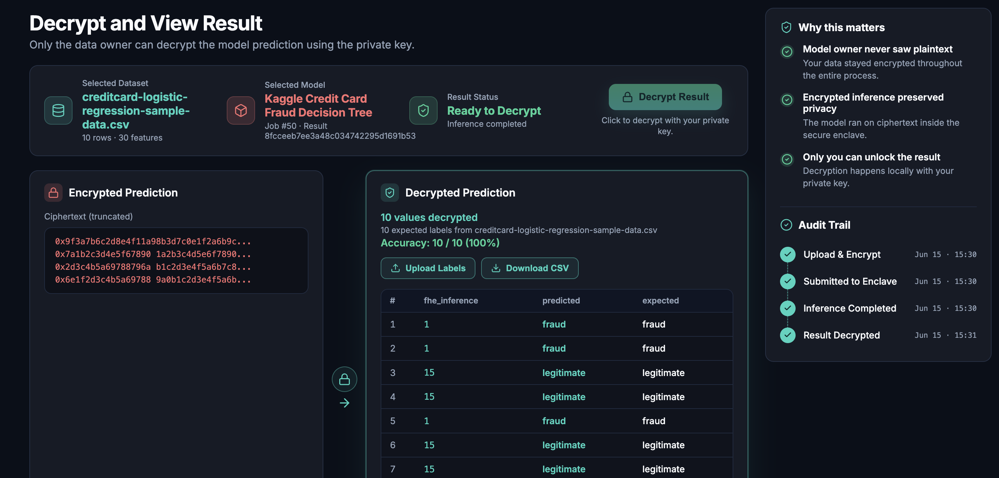

# Private AI Inference with FHE — TMLS Live Demo 2026

**01 Quantum AI Marketplace** · ~10 minutes · live walkthrough

> Story: **Bob** owns a credit-card-fraud model. **Alice** owns sensitive transaction data.
> Alice gets predictions without revealing her data, and Bob never exposes his model — thanks to **Fully Homomorphic Encryption (FHE)**.

**Timing budget**

| Slide | Topic | Time |
|-------|-------|------|
| 1 | The problem | 1:30 |
| 2 | The idea: compute on ciphertext | 1:00 |
| 3 | Bob builds & publishes a model | 2:00 |
| 4 | Alice: keys + local encryption | 2:00 |
| 5 | Encrypted inference runs | 1:30 |
| 6 | Alice decrypts the result | 1:30 |
| 7 | Why it matters / LLM policies | 0:30 |

---

## Slide 1 — The problem (1:30)

**Say:**
- Running ML on someone else's data forces a bad trade-off. Either the data owner ships raw data to the model — losing privacy — or the model is handed to the data owner — losing IP.
- For regulated data — payments, health, or **prompts sent to an LLM** — neither is acceptable.
- This is the 01 Quantum AI Marketplace. Two roles: **Data Owner** and **Model Owner**. Everything in between stays encrypted.

**Point at:** the four-step flow (top) and "Your data stays encrypted. The model never sees plaintext."

---

## Slide 2 — The idea: compute on ciphertext (1:00)

**Say:**
- FHE lets you run computation directly on encrypted data. The math happens on ciphertext; the result, once decrypted, is identical to running on plaintext.
- Four steps: (1) Alice generates a key pair, (2) encrypts locally, (3) Bob runs inference on ciphertext, (4) Alice decrypts.
- The private key never leaves Alice's machine. Bob never sees a single plaintext value.

**Transition:** "Let's start as Bob, the model owner."

---

## Slide 3 — Bob builds & publishes a model (2:00)

**Say:**
- This is Model Builder Studio. Bob designed a **Kaggle Credit Card Fraud Decision Tree** visually — features, thresholds, leaf classes (`fraud` / `legitimate`).
- He can also do logistic regression. Once happy, he **Publishes** to the enclave and optionally **Shares** with specific users.
- Key point: publishing exposes the model *for encrypted execution only*. The model definition is access-controlled by row-level security in the backend.

**Do (live):** hover a node, show feature/threshold panel; point at the published models in the library.

---

## Slide 4 — Alice: keys + local encryption (2:00)

**Say:**
- Now we're Alice. Step 1: she generates an **FHE key pair** locally — OpenFHE CKKS, depth 16. The private key stays in her workspace and never leaves.
- Step 2: she picks Bob's published model, drops in a CSV, and it's **encrypted in the browser** before upload.
- Notice: she chose Bob's decision tree, 16 params, but Bob still can't see her confidential data.

**Do (live):** show key card, select dataset, click encrypt.

---

## Slide 5 — Encrypted inference runs (1:30)

**Say:**
- The encrypted dataset is submitted to the platform. Bob's model runs **on ciphertext** — these inference jobs complete without anyone decrypting Alice's confidential data.
- Each job is tracked end to end: dataset, model, status, timestamps.

**Do (live):** point at completed jobs, then select one and "Continue to Decrypt Result."

---

## Slide 6 — Alice decrypts the result (1:30)

**Say:**
- Only Alice can unlock this — decryption happens **locally with her private key**.
- Left: the raw ciphertext. Right: decrypted predictions — `fhe_inference` vs expected — **10/10, 100% accuracy**. Same answers as plaintext, zero data exposure.
- The **audit trail** shows the full chain: uploaded & encrypted → submitted → inference completed → decrypted.

**Do (live):** click **Decrypt Result**, scroll the prediction table, point at the audit trail.

---

## Slide 7 — Why it matters & where it goes (0:30)

**Say:**
- Model owner never saw the confidential plaintext user data. Data owner never shipped raw data. Result is verifiable.
- The same pattern extends beyond fraud scoring to **LLM policy decisions** — deciding whether a request is allowed, classifying risk, or gating an action — **without exposing the prompt, the features, or the policy itself**.
- Architecture scales to **multiple enclaves per organization**: encryption and decryption stay local to each org; only ciphertext crosses the boundary.

**Close:** "Private by design, verifiable by default. Thank you — happy to take questions."

---

## Backup / Q&A notes

- **Scheme:** OpenFHE CKKS, multiplicative depth 16, 16384 slots.
- **What's encrypted:** the dataset and all intermediate inference values. Only the model definition and metadata are in plaintext (owner-controlled).
- **Access control:** Supabase row-level security — owners CRUD their own models; recipients read only models published & shared with them; FHE keys/datasets/results are owner-only.
- **Performance:** decision tree and logistic regression over batched CKKS; demo runs complete in seconds.
- **Failure modes to mention if asked:** depth must cover the model (trees need higher depth); key reuse across model types handled by a minimum depth.
